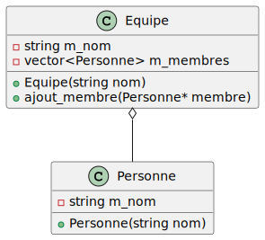
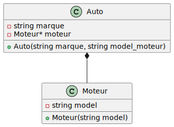

# Questionnaire C++

1) __Donner une définition d'un système temps réel ?__
Un système temps réel es un system quit doit fournir des résultat corrects dans un délais prédéfinit. Les contraintes de temps de réponse sont la principale caracteristique des systèmes temps réels.

2) __Quels sont vos librairies et outils préférés pour le développement en C++ ?__
- IDE: VSCode
- Build tools: Conan
- Libraries: Boost

3) __Que signifient : Polymorphisme, Encapsulation, Héritage ?__
- __Polymorphisme__ signifie plusieurs formes. Dans l'informatique c'est la capacité d'un object à faire référence à la super-class et ou à la sous-class en fonction du type de référence
- __Encapsulation__ possibilité pour une classe de décider ce qui va/peut être accessible/modifiable de l'extérieur. L'encapsulation est réalisée en C++ par les mot clés suivants:
  - _public_ : accessible et modifiable hors de la classe
  - _protected_: accessible et modifiable uniquement par les sous-classes
  - _privated_: pas accessible ni modifiable de l'extérieur
- __Héritage__ possibilité pour une classe d'étendre et de réutiliser le code d'une autre classe. La classe héritée est appelée "_super-class_", tandis que la class dérivée est appelée "_sous-class_"
```c++ {.line-numbers}
class Animal {
protected: //<- Tout ce qui suit ne peut être accessible que dans cette classe et les sous-classes de Animal
    std::string nom; // <-- Accessible uniquement ici et dans les sous-classes
public: //<- Tout ce qui suit ne peut être accessible
    virtual void bruit() {   // <-- La méthode bruit peut être accessible de l'extérieur et peut être redefinie par les sous class
        std::cout << "L'animal fait un bruit" << std::endl;
    }
};
class Chien: public Animal { // <-- polymorphisme: Chien hérite de la class Animal
  void bruit() {
      std::cout << "Le chien fait: bow wow" << std::endl;
  }
};
```

4) __Quelle définition donneriez-vous aux termes suivants : classe abstraite, méthode virtuelle, méthode virtuelle pure, surcharge ? Comment les implémenter en C++ ?__
- __Classe abstraite__ classe qui ne peut pas être instanciée directement, mais qui sert de modèle pour les sous-classes qui en héritent. Elle permet de créer une hiérachie de classe qui partage des caractéristiques communes, tout en fournissant une structure de base pour les sous-classes qui doivent  implémenter leur propre fonctionalité spécifique.
- __Méthode virtuelle__ méthode définie dans une classe de base qui peut être redéfinie (ou surchargée) par une sous-classe.
- __Méthode pure virtuelle__ méthode défini dans une classe abstraite qui n'a pas d'implémentation dans cette classe
- __Surcharge__ La surcharge de méthode est réalisée en définissant plusieurs méthodes avec le même ___nom___ dans une classe, mais les ___signatures___ différentes.
Exemple:
```c++ {.line-numbers}
class ExempleDeClassAbstraite { // <- doit avoir au moin une méthode pure virtuelle
public:
    virtual void methode_pure_virtuelle() = 0;
    virtual void methode_virtuelle() {
        std::cout << "Je suis une methode virtuelle" << std::endl;
    }
    void surcharge(int x) {
        std::cout << "La valeur de x est:" << x << std::endl;
    }
    void surcharge(float y) {
        std::cout << "La valeur de x est:" << y << std::endl;
    }
}
```
5) __Quelles sont les raisons de privilégier l'implémentation d'interfaces avec délégation plutôt que des chaînes d'héritage profondes ?__
L'implementation d'interface avec délégation:
- permet d'éviter les problèmes de résolution multiple d'héritage (Pour les languages ne supportant pas l'héritage multiples)
- offre une plus grande flexibilité
- facilite la réutilisation du code
- permet de respecter le principe de Liskov (mainternir une bonne séparation des préoccupations) et
- et simplifie la hiérachie d'héritage en divisant la fonctionnalité en petites parties indépendante.

6) __Quels sont vos sites Web préférés pour progresser en C++ ?__

7) __Selon vous, quel est le process idéal pour aborder le développement d'une fonctionnalité dans une petite équipe?__
les étapes suivante sont nécessaires:
- Étape 1- Comprendre les exigences:
- Étape 2- Planifier la fonctionalité  
    - définir les étapes nécessaire pour implementer la fonctionnalité
    - définir les rôles et responsabilités de chaque membre de l'équipe
    - définir les dépendances éventuelle et les échéances
- Étape 3- Crée un prototype (PoC). Cette étape est optionel et intéressant dans la majorité des cas pour les fonctionnalités complexes. Cela permettra de tester rapidement l'approche choisie et de vérifier si les exigences sont correctement comprises.
- Étape 4 - Implementer  la fonctionnalité: Il es important de suivre les bonnes pratiques de développement de logiciels, telles que:
    - la programmation en équipe 
    . les test unitaires
    - la revue de code
    - l'intégration continue
    
8) __Quelle est votre façon d'utiliser les exceptions ?__

9) __Quels diagrammes UML utilisez-vous ?__
- Diagramme de cas d'utilisation
- Diagramme de classe
- Diagramme de séquence
- Diagramme d'activité ou d'état
- Diagramme de composant

10) __En UML quelle est la différence entre agrégation et composition ? Donnez un exemple de chaque en C++.__
- Dans une ___relation d'agégation___, une classe peut contenir d'autres classes, mais ces dernières peuvent exister indépendamment de la classe conteneur.
Exemple:



```c++ {.line-numbers}
class Personne {
public:
    Personne(const std::string& name): m_name(name) {}
    virtual ~Personne(){}
private:
    std::string _name;
};

class Equipe {
public:
    Equipe(const std::string& name): m_name(name){}
    virtual ~Equipe(){}
    
    void ajoutMembre(Personne* membre) {
        m_membres.push_back(membre);
    }
private:
    std::string m_name;
    std:::vector<Personne*> m_membres;
    
};
```
Dans cet exemple, la classe "___Equipe___" est une classe qui agrège plusieurs abjets de la classe "___Personne___". Les objects "Personne" peuvent exister indépendamment de la classe "Equipe", et ils peuvent être ajoutés ou rétirés de la classe "Equipe" sans être détruite.
- Dans une ___relation de composition___, une classe contient d'autres classes qui dépendent de la classe conteneur et qui ne peuvent pas exister sans elle.
Exemple:



```c++ {.line-numbers}
class Moteur {
public:
    Moteur(const std::string& model): m_model(model) {}
    virtual ~Moteur() = default;
private:
    std::string m_model;
};
class Auto{
public:
    Auto(const std::string& marque, const std::string& model_moteur): 
        m_marque(marque),
        m_moteur(std::make_unique<Moteur>(model_moteur))) {}
    virtual ~Auto() = default;
private:
    std::string m_marque;
    std::unique_ptr<Moteur> m_moteur;
}
```
Dans cet exemple, la classe "___Auto___" est une classe qui contient un object de la classe "___Moteur___". L#object "Moteur" dépend de la classe "Auto" et ne peut pas exister sans elle. La classe "Auto" est responsable de la création et de la destruction de l'objet "Moteur", ce qui montre une rélation de composition.

11) __Qu'est-ce que le Scrum ? Intérêt et dangers ?__
- Le Scrum est une méthode de gestion de project Agile qui permet de livrer des produits fonctionnels rapidement et régulièrement en utilisant des itération courtes apelées __sprints__. Scrum aide les équipes:
    - à travailler de manière plus collaborative
    - à améliorer la communication 
    - a s'adapter aux changements tous au long du project.
- Avantages:
    - Livraison régulière de produits fontionnels
    - Adaptabilité
    - Collaboration
- Dangers
    - la Complexité
    - la pression
    - la dépendance au Product Owner
    
12) __En UML, comment définissez-vous un stéréotype ? Comment l’implémentez-vous en C++ ?__

13) __En C++, quelles différences existe-t-il entre une struct et une classe ?__

|    | struct | class |
| -- | ------ | ------ |
| Visibilité des membres | __public__ par défaut | __private__ par défaut |
| Héritage | __public__ par défaut | __private__ par défaut |
| Type mémoire | Une structure es de type valeur: ces objets sont crées dans la mémoire de pile | Une classe es de type référence: ces objects sont crées dans la mémoire du tas|
|Convénance| lAdaptée aux petits objects |Adaptée aux objects plus grands ou complexes|

14) __Un destructeur peut-il être virtual pure ? Pourquoi ?__
- Un destructeur virtuelle pure es défini en utilisant la syntaxe 
```c++
virtual ~NomDeClass() = 0;
```
cela signifie que la classe est abstraite et qu'elle ne peut pa être instaciée directement.

15) __A quoi servent les mots clef 'mutable' et 'explicit' ?__
- __mutable__: est utilisé pour rentre un membre de classe modifiable même si la fonction memebre qui l'utilise es constante.
Exemple
```c++
class Counter {
public:
    mutable int count;
    Counter(int initial_count): count(initial_count){}
    
    void increment() const {
        ++count; // Nous pouvons modifier la variable "count" grâce à "mutable"
    }
};
```
- __explicit__: est utilisé pour empêcher la conversion implicite d'un object d'une classe à un autree type de données, en utilisant un constructeur qui prend un seul argument.
Exemple
```c++
class MyClass {
public:
    int x;
    explicit MyClass(int _val): x(x_val){}
};
int main() {
    // La conversion implicite n'est pas autorisée car le constructeur es ecplicit
    // MyClass obj1 = 5;
    
    // Conversion explicite en utilisant le constructeur
    MyClass obj2 =MyClass(5);
    std::cout << "x = "<< obj2.x << std::endl;
}
```

16) __quelle est la différence entre une 'std::map<>' et une 'std::multimap<>' ?__
- La classe 'std::map' est une structure de données associative qui stocke les élements triés selon les clés. Elle permet l'accès rapide à une valeur associée à une donnée en utilisant l'operateur d'indexation []. Si une clé existe déjà dans la map, l'élément est remplacé par la nouvelle valeur. Si une clé n'existe pas encore, un nouvel élément est ajouté.
- La classe 'std::multimap' est similaire à 'std::map', mais elle permet de stocker plusieurs éléments ayant la même clé. Les éléments sont triés selon la clé, puis selon l'ordre d'insertion. Contrairement à 'std::map', l'opérateur [] n'est pas disponible, car plusieurs éléments peuvent avoir la même clé. Pour accéder aux éléments d'une clé donnée, il faut utiliser les fonctions 'lower_bound()' et 'upper_bound()' qui renvoient les itérateurs sur les éléments correspondants.

17) __Comment définiriez-vous un Pattern ? Citez-en trois.__
Comment définiriez-vous un Pattern ? Citez-en trois.
Un Pattern peut être défini comme une solution réutilisable à un problème commun dans un contexte donné. Il s'agit d'un modèle ou d'une structure que l'on peut appliquer à plusieurs situations similaires pour résoudre des problèmes similaires.
- Trois Patterns
    - Singleton
    - Observer
    - Chain of Responsibilit

18) __Quels sont les avantages/désavantages d'utiliser des Threads ?__
- L'utilisation des threads permet d'exécuter plusieurs tâches simultanément. ce qui peut améliorer les performances globales d'un programme
- L'utilisation de threads permet d'utiliser efficacement les resources du système, car elle permet d'exécuter plusieurs tâches en parallèle sur un processeur multicoeur.

19) __Dans quel ordre sont appelés les constructeurs et les destructeurs des objets membres d’une classe ?__
Les constructeurs et destructeurs des objets membres d'une classe sont appelés dans l'ordre suivant :
1. Les constructeurs des membres statiques de la classe sont appelés en premier. Les membres statiques sont des variables de classe qui sont partagées entre toutes les instances de la classe.
2. Ensuite, les constructeurs des membres non statiques de la classe sont appelés dans l'ordre de déclaration dans la classe.
3. Une fois que tous les constructeurs des membres ont été appelés, le constructeur de la classe elle-même est appelé.

Lorsqu'un objet est détruit, les destructeurs sont appelés dans l'ordre inverse: 
- Tout d'abord, le destructeur de la classe est appelé.
- Suivi des destructeurs des membres non statiques dans l'ordre inverse de leur appel dans le constructeur de la classe.
- Puis le destructeur des membres statiques est appelé en dernier.

20) __Dans quel ordre sont appelés les constructeurs et les destructeurs des classes de base d’une classe dérivée utilisant l’héritage multiple ?__ 
Dans le cas d'une classe dérivée utilisant l'héritage multiple, l'ordre d'appel des constructeurs et des destructeurs des classes de base est déterminé par l'ordre dans lequel les classes de base sont spécifiées dans la liste d'héritage.

- Lors de la construction d'un objet dérivé, les constructeurs des classes de base sont appelés dans l'ordre inverse de leur spécification dans la liste d'héritage. Par exemple, si une classe dérivée D hérite de deux classes de base B1 et B2, spécifiées dans cet ordre, alors le constructeur de B2 sera appelé en premier, suivi du constructeur de B1, puis du constructeur de D.
- Lors de la destruction d'un objet dérivé, les destructeurs des classes de base sont appelés dans l'ordre inverse de celui de leur construction. C'est-à-dire que le destructeur de D sera appelé en premier, suivi du destructeur de B1, puis du destructeur de B2.

21) __A quoi sert l’héritage virtuel ?__ 
L'___héritage virtuel___ est une technique utilisée en programmation orientée objet pour résoudre les ambiguïtés qui peuvent survenir lorsqu'une classe dérivée hérite de plusieurs classes de base qui ont une classe de base commune. L'héritage virtuel permet de s'assurer qu'une classe de base commune n'est instanciée qu'une seule fois, quelle que soit le nombre de fois où elle est héritée.

Exemple
```c++
#include <iostream>
using namespace std;
class Animal {
public:
    virtual void deplace() {
        cout << "L'animal se déplace." << endl;
    }
};
class AnimalTerrestre : public virtual Animal {
public:
    virtual void deplace() {
        cout << "L'animal terrestre marche." << endl;
    }
};
class AnimalAquatique : public virtual Animal {
public:
    virtual void deplace() {
        cout << "L'animal aquatique nage." << endl;
    }
};
class Amphibien : public AnimalTerrestre, public AnimalAquatique {
public:
    // L'appel à la méthode deplace() est ambigu sans l'utilisation de l'héritage virtuel
    // Avec l'héritage virtuel, la méthode deplace() de la classe de base virtuelle Animal est appelée
};
int main() {
    Amphibien grenouille;
    grenouille.deplace(); // affiche "L'animal se déplace."
    return 0;
}
```

22) __En C++, que signifie RAII ? Expliquez ce concept.__
RAII est l'acronyme de "Resource Acquisition Is Initialization", ce qui signifie en français "l'acquisition de ressources se fait lors de l'initialisation". C'est un concept important en C++, qui est utilisé pour garantir que les ressources allouées dynamiquement sont correctement gérées.
Exemple
```c++
class Resource {
public:
    Resource() {
        // Allocation dynamique de la mémoire
        m_data = new int[100];
    }
    ~Resource() {
        // Libération de la mémoire
        delete[] m_data;
    }
private:
    int* m_data;
};
int main() {
    // Création de l'objet Resource qui alloue la mémoire lors de l'initialisation
    Resource res;
    // Utilisation de la mémoire allouée
    res.m_data[0] = 42;
    // La mémoire est automatiquement libérée lorsque l'objet res sort de portée
    return 0;
}
```
Dans cet exemple, la classe `Resource` est une classe de gestion de ressource qui alloue de la mémoire dynamiquement dans son constructeur et libère cette mémoire dans son destructeur. Lorsque nous créons un objet `Resource`, la mémoire est allouée automatiquement. Lorsque l'objet sort de portée, le destructeur est appelé automatiquement et la mémoire est libérée.

23) __Quelles évolutions vous semblent les plus intéressantes dans la norme C++11 ?__
- Lambdas : Les lambdas sont des fonctions anonymes qui peuvent être définies à l'intérieur d'une fonction ou d'une expression. 
- Déduction de type automatique : Il est désormais possible de déclarer une variable sans préciser son type grâce à l'opérateur `auto`. Le compilateur détermine automatiquement le type de la variable à partir de la valeur d'initialisation.
- Nouvelles bibliothèques : C++11 introduit de nouvelles bibliothèques standard, telles que `thread`, `mutex` et `atomic`, qui facilitent la programmation multithread.
- Mots-clés `constexpr` et `nullptr` : constexpr permet de déclarer des fonctions et des variables constantes qui peuvent être évaluées à la compilation, tandis que `nullptr` est utilisé pour représenter un pointeur nul.
- Boucle for améliorée : La syntaxe de la boucle for a été améliorée pour prendre en charge les itérateurs de la bibliothèque standard, les tableaux et les expressions qui se comportent comme des conteneurs.
- R-value references : Les références de valeurs droites permettent de manipuler les objets temporaires de manière plus efficace et sécurisée, en évitant les copies inutiles.
- Move semantics : Les sémantiques de déplacement permettent de transférer efficacement les ressources d'un objet à un autre, sans effectuer de copie.

24) __Comment décrire votre philosophie de programmation?__

25) __Qu'est-ce que du bon code?__

26) __Quelle approche suivez-vous pour tester vos programmes ?__
